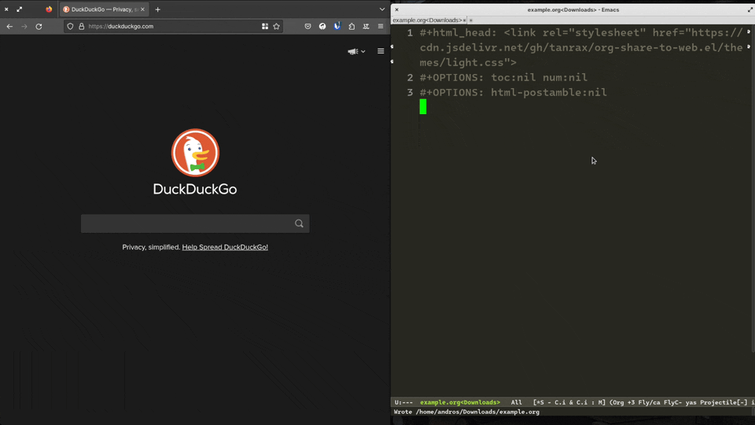

Share an Org buffer as a web page. In addition, a URL will be created that you can share to view it.



## Requirements

- **Domain**: To access the file share.
- **Hosting**: To host the file share. It is recommended to use a server with SSH access.
- **TRAMP**: To access the hosting.

## Install

Add in your `init.el`.

```elisp
(use-package org-share-to-web
  :straight (:host github :repo "tanrax/org-share-to-web.el" :files ("org-share-to-web.el"))
  :ensure t)
```

## Configure

Configure the domain to be used to access the file share and the directory where it will be hosted using TRAMP.

```elisp
(setq org-share-to-web-domain "") ; Domain
(setq org-share-to-web-directory "") ; TRAMP path
```
Example.

```elisp
(setq org-share-to-web-domain "https://mydomain.com/")
(setq org-share-to-web-directory "/ssh:debian@mydomain.com:~/www/")
```

The domain must end with `/`. The directory must end with `/` and start with `/ssh:` or another TRAMP method.

## Run

Open an Org file and run `org-share-to-web-buffer`.

It will copy the URL to your clipboard to open the document share.

If you need to manage the shared files, such as deleting them, use `org-share-to-web-dired`.

## Theme

If you want it to look really nice, include the following lines at the beginning of your Org documents.

### Light

```org
#+html_head: <link rel="stylesheet" href="https://fonts.googleapis.com/css2?family=Lora:wght@500&display=swap">
#+html_head: <link rel="stylesheet" href="https://fonts.googleapis.com/css2?family=Inconsolata&display=swap">
#+html_head: <link rel="stylesheet" href="https://cdn.jsdelivr.net/gh/tanrax/org-share-to-web.el/themes/light.css">
#+OPTIONS: toc:nil num:nil
#+OPTIONS: html-postamble:nil
```
